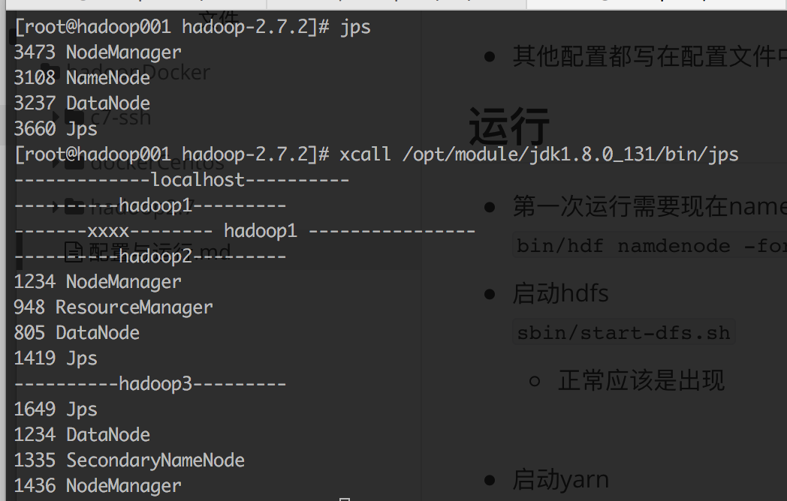

配置
----- 
|节点|HDFS|YARN|
|---|---|---|
|001|NodeManager，DataNode|NameNode|
|002|DataNode|ResourceManager|
|003|SecondaryNameNode，DataNode|NameNode|

- 其他配置都写在配置文件中了

运行
---
- 第一次运行需要现在namenode节点格式化
  ```bin/hdf namdenode -format```
- 启动hdfs
  ``` sbin/start-dfs.sh```
- 启动yarn
    ``` sbin/start-yarn.sh```

    

- 都正常应该是出现

  

- 注意：
  - 出现地址错误，检查下自己配置的地址是不是对的.